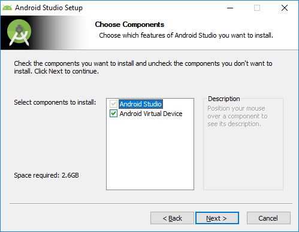
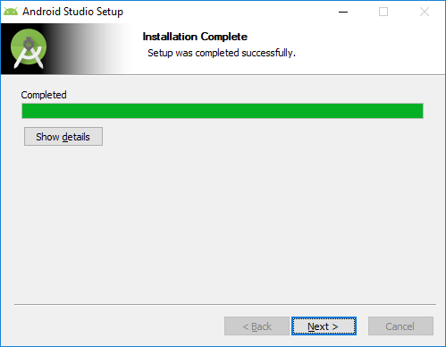
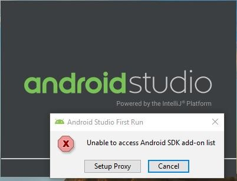
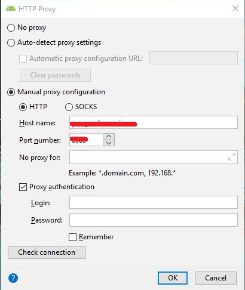
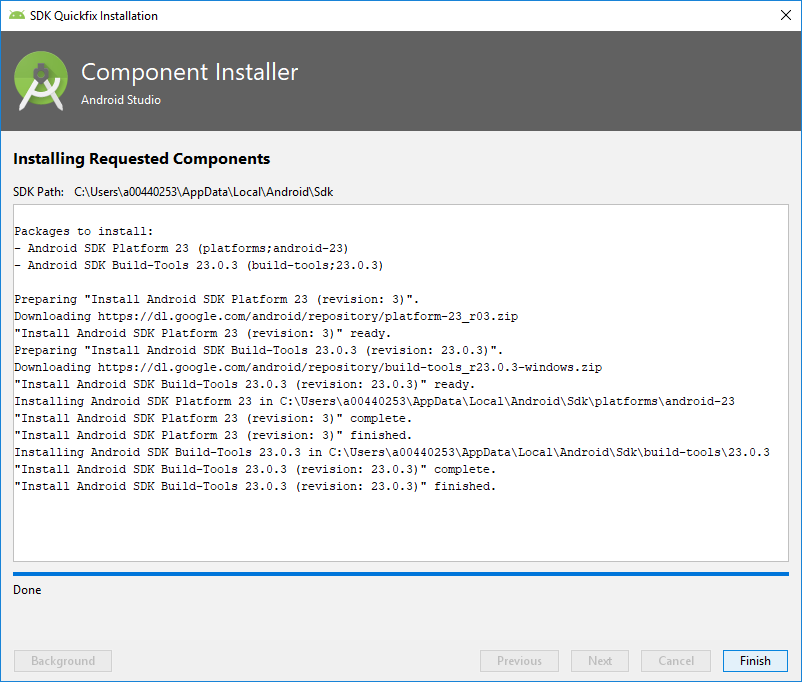
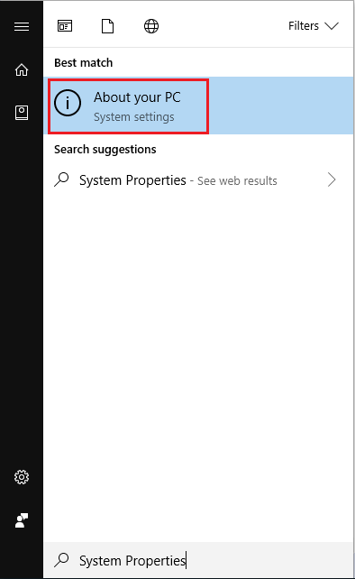
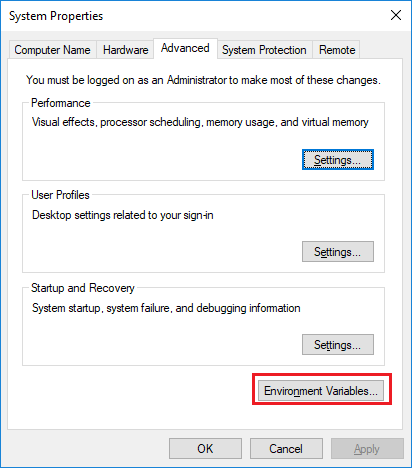

## Step 2:  Setup Android Studio, Node JS and Git

### Enable Virtualization in BIOS

Android Studio emulator requires hardware acceleration.  It is done by enabling virtualization from the machine's BIOS.  
1.	Find out how to get into BIOS menu of your laptop or desktop.  It usually involvse rebooting the machine and pressing some function key(s), e.g. F2.  
2.	Once inside the BIOS menu, look for a Virtualization Support items.  Enable them.

***

### Setup Android Studio

Android Studio is an IDE for mobile application development.  It comes with mobile phone emulators for development and testing purposes.  We will use Android Studio as the development tool in this tutorial.  

The following instructions are for installing Android Studio on Windows 10.  If you are running a different operating system or need more information.  Please visit [https://developer.android.com/studio/install](https://developer.android.com/studio/install).  

1.	Download latest Android Studio installer from the following link.  (https://developer.android.com/studio/).  For example: android-studio-ide-181.5056338-windows.exe  


2.	Double click the downloaded exe file to start installer.  Click **Next**.  


3.	Keep the default list of components to install.  Click **Next**.  


4.	Installation location.  You may keep the default or specify a different one.  Click **Next**.  


5.	Click **Install** to start install.  Once it is completed, click **Next**.  


6.	Click **Finish** to complete the installation.  


7.	When starting Android Studio the first time, if the laptop or desktop is behind proxy, it may ask for proxy setup information.  Enter proxy information.  
  
  

8.	If Android SDK is not installed, it will ask you to install the Android SDK.  Follow the installer instructions to install Android SDK.  Use the provided default values.  
  

9.	This is the screen when you start Android Studio the first time.  
  

10.	We will need to update the IDE to latest update.  Click **Configure -> Check for Updates** at the lower right corner to start update.  
  

11.	The following screen shows up once the update is completed.  
  

For more information, please refer to the following references:  

- [https://developer.android.com/studio/run/emulator-acceleration](https://developer.android.com/studio/run/emulator-acceleration)  
- [https://developer.android.com/studio/run/emulator](https://developer.android.com/studio/run/emulator)  

***

### Install Android Studio Components

This tutorial uses **Android SDK Platform 25, 26, 27** and **Google APIs Intel x86 Atom_64 System Image**.  Follow the instructions below to install them.  If any component is missing, the build tool will indicate them and ask to install them as well.  

1.	Click **Configure -> SDK Manager**.

2.	In the SDK Platforms tab, check the Show Package Detail checkbox.  
  

3.	Check the checkbox indicated in the image,  
  

4.	Click **Apply** and follow the instructions to start install.  Once completed, it shows the following screen.  
  

***

### Setup Environment Variable

We need to add adb.exe (Android Debug Bridge) to PATH variable and JAVA_HOME variable.    
adb.exe is located in C:\Users\{{Your Username}}\AppData\Local\Android\Sdk\platform-tools in Windows 10.     
JAVA_HOME is where Java JDK is installed.  

1.  Search for **System Properties** in the Windows Start Menu.  Open System Properties panel.  
         

2.  Click **Environment Variable** button to open the Environment Variable panel.


3.  Look for **Path** under User Variables section.  Edit it and add the folder containing adb.exe to the path.  

4.  If JAVA_HOME is not set in the System Variables section, add JAVA_HOME.
  

***

### (Optional) Setup Node.js

Node JS is a SDK / Programming Language used in this tutorial.   The version of Node.js used in this tutorial is v10.13.0.  Follow the step below to install Node.js.  

1.	Download the Node.js installer from this URL.  [https://nodejs.org/en/download/](https://nodejs.org/en/download/).  This tutorial is written with Windows 10 and uses the 64-bits Windows Installer (.msi)  

2.	After download is completed, double click the downloaded .msi file to start the installer.  
  

3.	Follow the instructions to install Node.js.    

4.	After installation is completed, verify the installation by opening the Command Prompt.  Run ‘node –v’ and ‘npm –v’ to verify installation and version.  
  

5.	(Optional)  Proxy setup.  Depending on the location of the laptop / desktop, proxy settings may be needed.  Run the following command to configure proxy.  Change the proxy host and port to your company proxy accordingly.  

```
   npm config set proxy http://proxy.mycompany.com:8080
   npm config set https-proxy http://proxy.mycompany.com:8080
```

Or use the below commands if id and password are required from proxy. If your password contains special characters, you will need to encode them, e.g. `#` will become `%23`

```
   npm config set proxy http://<user>:<password>@proxy.mycompany.com:8080
   npm config set https-proxy http:// <user>:<password>@proxy.mycompany.com:8080
```

***

### (Optional) Setup Git

Git is a source code management tool used in this tutorial.  Follow the step below to install Git client.  

1.	Download the Git client installer from this URL.  [https://git-scm.com/downloads](https://git-scm.com/downloads).  This tutorial is written with Windows 10 and uses the 64-bits Windows Installer.  

2.	After download is completed, double click the downloaded .exe file to start the installer.  
 

3.	Follow the instructions to install the Git client. This screen shows up when installation is completed.  
  

4.	(Optional)  Proxy setup.  Depending on the location of the laptop / desktop, proxy settings may be needed.  Run the following command to configure proxy.  Change the proxy host and port to your company proxy accordingly.

```
   git config --global http.http://github.com.proxy http://<user>:<password>@proxy.mycompany.com:8080
   git config --global http.http://github.com.sslverify false
   git config --global http.https://github.com.proxy http://<user>:<password>@proxy.mycompany.com:8080
   git config --global http.https://github.com.sslverify false
```


