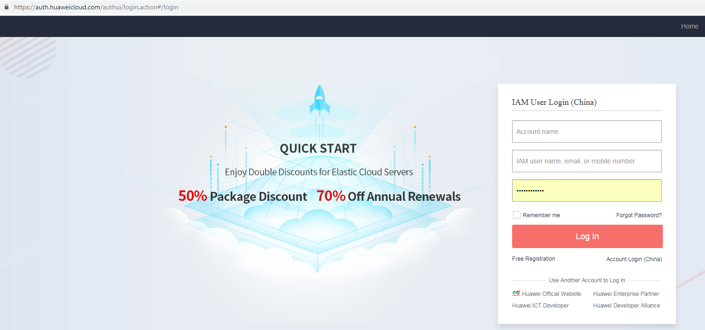

## Step 5:  Enable Voice Recognition Service

1.	Login to Huawei cloud.  
https://www.huaweicloud.com

2.	Select 'Automatic Speech Recognition' service from Enterprise Intelligence > Automatic Speech Recognition 

3.	Click on Try Now.  

  

4.  Click on Sentence Recognition from the left menu.Click on Subscribe button.The service will be availabe to use now.
    After the service is enabled you can view the details as below.
  

    Refer to https://support.huaweicloud.com/en-us/api-asr/asr_03_0006.html for more details about Automatic Voice Recognition service APIs.
