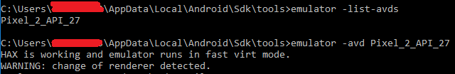
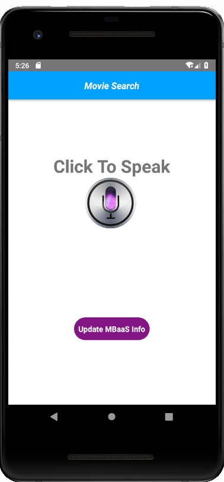
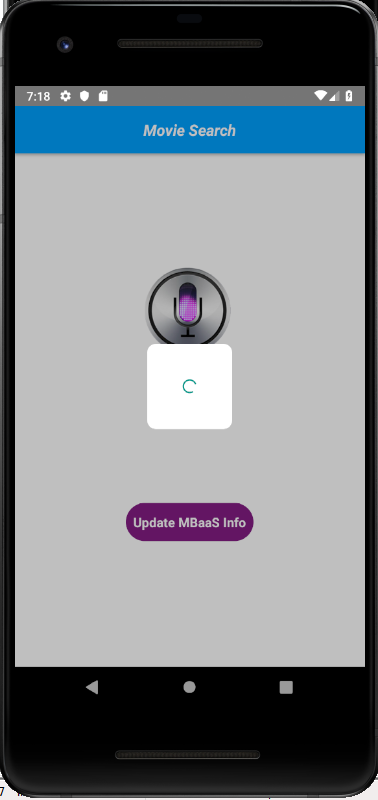

## Step 8:  Run Mobile App in emulator

At this point, setup of the Mobile Application sample, Android Studio and Emulator should be completed.  Follow the instructions below to run the Mobile Application the Emulator.  

1.	**Important**:  If you are developing behind a proxy, proxy may return **Accept Risk page** when the emulator connects to the Mobile Backend.  Before continuing, follow Step 4 to open Mobile Backend Dashboard in your browser and **Accept Risk**.  Keep the Mobile Backend Dashboard alive in the web browser to prevent the proxy from viewing the **Accept Risk** page again.

2. Open a command prompt, go to C:\Users\{{Your Username}}\AppData\Local\Android\Sdk\emulator, where the emulator.exe is located.  

3. Find out the list of emulator by running the following command.  

```
   emulator -list-avds  
```

4. Start emulator using the following command.  Emulator should show up.  

```
   emulator -avd {{avd_name}}
```
 

5.	Open another command prompt, change to **{{path to}}/VoiceReco**.  

6.	Run the following command to bundle the sample code.   

```
   react-native bundle --platform android --dev false --entry-file index.android.js --bundle-output android/app/src/main/assets/index.android.bundle --assets-dest android/app/src/main/res
```

7. Run the following command to run the sample mobile application in the running emulator.  

```
   react-native run-android
```
 

8. Click on icon to speak any movie name in Mandarin

 

9. On voice input, click again on the icon. Search request will be sent to server and loading icon will be shown till the request is complete.

 

10. On successful data retrieval movie details will be shown.